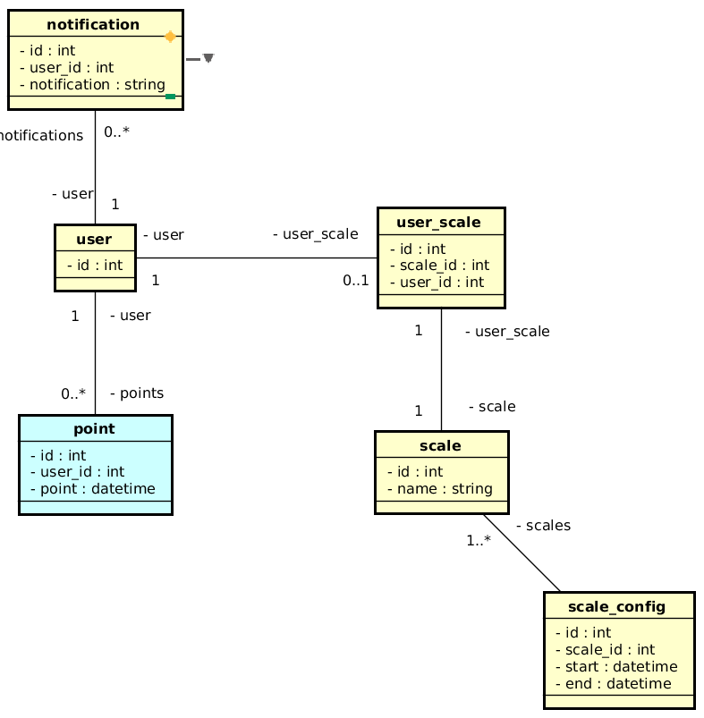

# MyPoint

## Sobre o projeto

MyPoint é um sistema de registro de pontos de funcionários, utilizando filas com o RabbitMq.

## Qual problema resolve?

O registro de ponto ocorre geralmente sempre nos mesmos horários por todos os funcionários de uma empresa, gerando um estress no servidor de banco de dados, com isso, a técnica de utilização de filas se enquandra como uma solução para resolver o devido problema.

## Autor

👉 <a href="https://www.linkedin.com/in/venzel">Edivam Enéas de Almeida Júnior</a> 

## Stack de tecnologias utilizada nesse projeto

  
  
  
  
  
  

-   NestJs
-   RabbitMq
-   Cognito
-   Typescript
-   TypeORM / Postgres
-   TDD com Jest

## Técnicas

-   Microserviços
-   Broker baseado no RabbitMq
-   Interceptors
-   Transformers
-   Validators
-   Authentication
-   Upload

## Arquitetura

### Broker Based

Permitem desacoplar vários componentes da aplicação. Cada componente somente precisa se conectar ao broker, e pode permanecer sem necessidade de conhecer a existência, localização ou detalhes da implementação de outros componentes. A única coisa que precisa ser compartilhada entre os componentes é o protocolo de mensagens.

### Um broker se divide em:

-   **Broker Server**: Processo do lado do servidor, responsável por gerenciar a publicação, assinatura e entrega das mensagens aos clientes.

-   **Broker Client API**: É disponibilizado em um package específico para cada linguagem (JavaScript, Java, Go, etc), fornecendo uma API para acessar o broker, a partir de aplicações clientes.

### Modelo de comunicação entre Publishes/Subscribes

### Modelo de comunicação entre Request/Response

## Diagrama de relacionamentos

👉 [API Gateway]("./api-gateway/README.md") 
👉 [User]("./user/README.md") 
👉 [Point]("./user/README.md") 
👉 [Scale]("./scale/README.md") 
👉 [Notification]("./notification/README.md")
