# MyPoint

[](https://github.com/venzel/mypoint/blob/master/LICENSE)

## 📜 Sobre

> **MyPoint** é um sistema de registro de pontos de funcionários, utilizando filas com o RabbitMQ.<br /> <a href="http://mypoint.venzel.com.br/api">👉 MyPoint</a>

## Qual problema resolve?

O registro de ponto ocorre geralmente sempre aos mesmos horários por todos os funcionários de uma empresa, gerando um stress no servidor de banco de dados, com isso, a técnica de utilização de filas se enquandra como uma solução para resolver o devido problema.

## 👤 Autores

| Foto                                      | Nome                                        | Ativo | Dt. inativo | Atribuições                             |
| ----------------------------------------- | ------------------------------------------- | ----- | ----------- | --------------------------------------- |
|  | [Enéas Almeida](https://github.com/venzel/) | 🔥    | -           | Manager, Arquiteto, FullStack Developer |

## ⚓ Links

👉 [Git do backend](./backend/README.md)<br />
👉 [Git do frontend](./frontend/README.md)<br />
👉 [Swagger de QA](http://mypoint-qa.venzel.com.br/api)<br />
👉 [Swagger de Produção](http://mypoint.venzel.com.br/api)<br />
👉 [Sistema em produção](http://mypoint.venzel.com.br)<br />
👉 [Sistema em QA](http://mypoint-qa.venzel.com.br)<br />
👉 [VS Code (Settings, Keybinds, Theme e Plugins)](./VSCODE.md)<br />
👉 [Ferramentas & Serviços](./TOOLS.md)<br />
👉 [FAQ Geral](./FAQ.md)<br />

## Etapas de desenvolvimento

1. Levantamento do problema a ser resolvido **(Briefing)**;
2. Levantamento dos requisitos funcionais;
3. Definição da arquitetura utilizada;
4. Definição das tecnologias utilizadas;
5. Definição das atribuições e cronograma de estimativas no desenvolvimento das atividades;
6. Criação do diagrama de relacionamentos e testes de hipóteses;
7. Desenvolvimento da documentação e diagramas explicativos no Git;
8. Diagramação das telas (UX Design);
9. Configurações dos ambientes de QA e Produção;
10. Desenvolvimento do MVP.<br />
    10.1. Desenvolvimento da backend;<br />
    10.2. Desenvolvimento do frontend;<br />
    10.3. Integração do frontend com o backend.

## ⌛ Cronograma de estimativas no desenvolvimento das atividades

| Atividade                                               | Esforço (Fibonacci) | Finalizado? | Execução |
| ------------------------------------------------------- | ------------------- | ----------- | -------- |
| Levantamento do problema a ser resolvido **(Briefing)** | 3                   | 🔥          | 100%     |
| Levantamento dos requisitos funcionais                  | 1                   | 🔥          | 100%     |
| Definição das tecnologias utilizadas                    | 1                   | 🔥          | 100%     |
| Criação da documentação no Git                          | 16                  | -           | 70%      |
| Diagramação das telas (UX Design)                       | 16                  | -           | 0%       |
| Configuração do ambiente de QA e produção               | 5                   | -           | 0%       |
| Desenvolvimento do backend                              | 21                  | -           | 0%       |
| Desenvolvimento do frontend                             | 21                  | -           | 0%       |
| Integração do backend com o frontend                    | 21                  | -           | 0%       |

### Significados dos esforços na escala Fibonacci

-   **Esforço 1** - Representam 2 horas.
-   **Esforço 5** - Representam 10 horas.
-   **Esforço 21** - Representam horas não determinadas.

## Backend

<p align="left">
  
  
  
  
  
  
</p>

-   NestJs
-   RabbitMQ
-   Cognito (**AWS**)
-   Typescript / Javascript
-   TypeORM / Postgres / MongoDB
-   Testes com métricas de coverages (**Jest**)

👉 [Link para o git do backend](./backend/README.md)<br />

## Persistência dos dados

<p align="left">
  
  
  
</p>

-   Postgres
-   MongoDB

\* Os bancos de dados são provenientes de containers do docker.

## Frontend

<p align="left">
  
   
</p>

-   VueJs
-   Javascript

👉 [Link para o git do frontend](./frontend/README.md)<br />

## Backend/Frontend

<p align="left">
  
  
</p>

-   [Docker](./media/faq/docker-commands.md)
-   [Codeship (**CI/CD**)](./media/faq/codeship.md)

## Infraestrutura

<p align="left">
  
  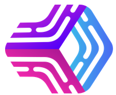
  
</p>

-   [Nginx](./media/faq/nginx-install-and-configure.md)
-   [PM2](./media/faq/pm2-configurations.md)
-   [Docker](./media/faq/docker-commands.md)

## Recursos e técnicas utilizadas

-   Microserviços
-   Filas com RabbitMQ
-   Authorization/Authentication com o Cognito
-   Interceptors
-   Transformers
-   Validators
-   Captura de errors com o Sentry
-   Padronização de commits (**Conventional commits**)
-   Swagger
-   Upload
-   Padronização de código (**Sonarlint**)

## Arquitetura

<p align="center">
    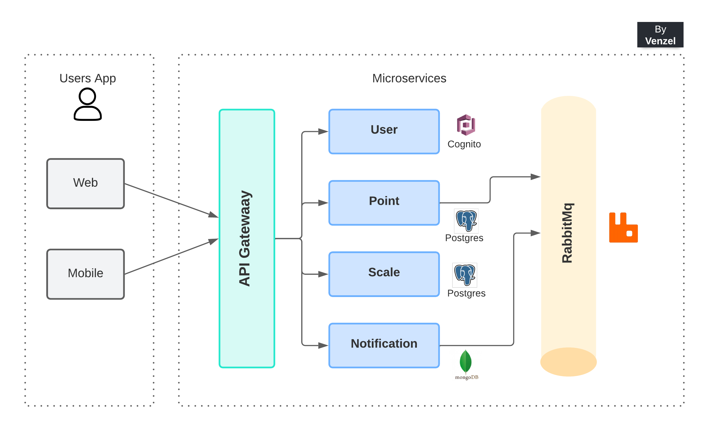
</p>

| Descrição                    | Data de modificação | Versão | Link de download                              |
| ---------------------------- | ------------------- | ------ | --------------------------------------------- |
| Primeira versão do documento | 01 de abril de 2022 | v1     | [Download](./media/images/architeture-v1.png) |

👉 [Link do arquivo no Lucidchart](https://lucid.app/documents/view/a545d2ed-00e7-4a88-b0b3-d805b2e059f8)

<hr />

### Filas com o RabbitMQ

<p align="center">
    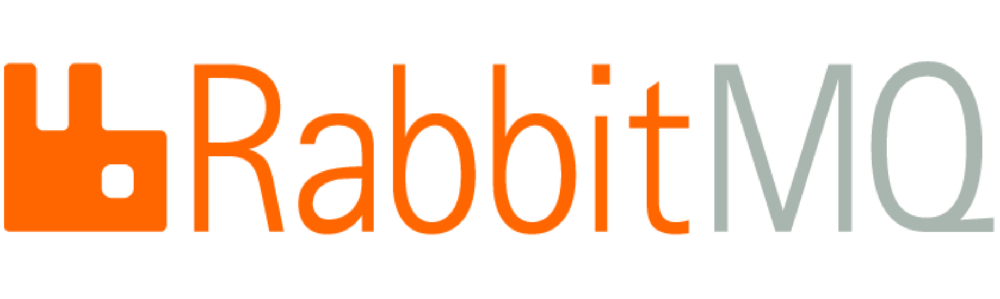
</p>

A utilização de filas permitem desacoplar vários componentes da aplicação.

Cada componente somente precisa se conectar ao broker, e pode permanecer sem necessidade de conhecer a existência, localização ou detalhes da implementação de outros componentes.

A única coisa que precisa ser compartilhada entre os componentes é o protocolo de mensagens.

### Um broker se divide em:

-   **Broker Server**: Processo do lado do servidor, responsável por gerenciar a publicação, assinatura e entrega das mensagens aos clientes.

-   **Broker Client API**: É disponibilizado em um package específico para cada linguagem (JavaScript, Java, Go, etc), fornecendo uma API para acessar o broker, a partir de aplicações clientes.

### Modelo de comunicação entre Publishes/Subscribes

<p align="center">
    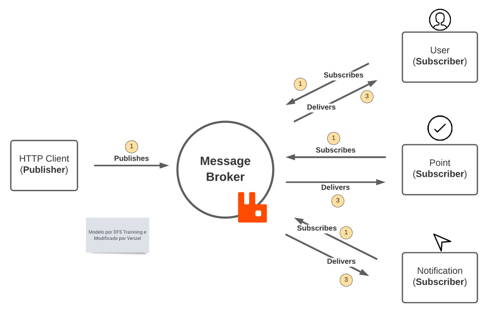
</p>

### Modelo de comunicação entre Request/Response

<p align="center">
    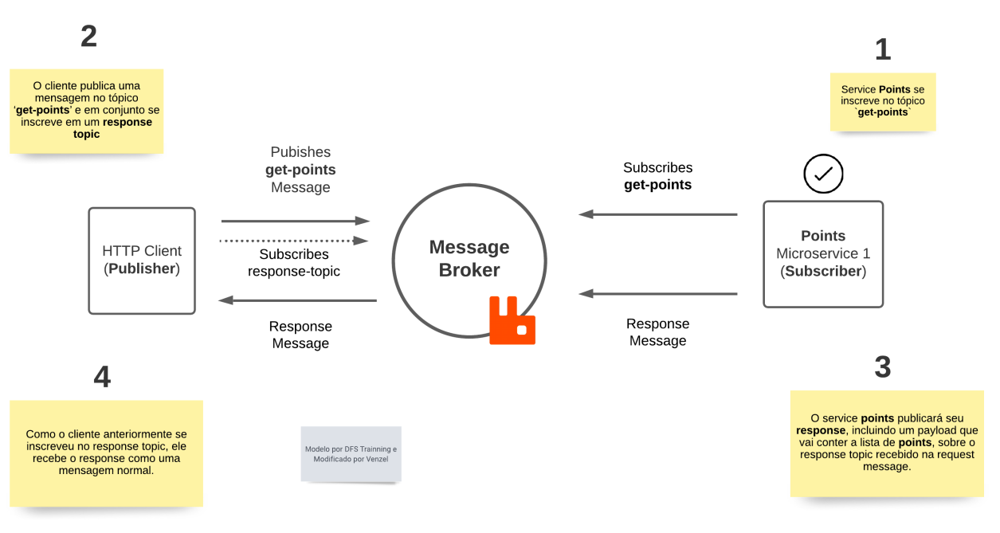
</p>

<hr />

### Cognito (Autenticação e Autorização)

O **Cognito** é um serviço da **Amazon** fornece autenticação, autorização e gerenciamento de usuários para aplicações Web e móveis. Os usuários podem fazer login diretamente com um nome de usuário e uma senha ou por meio de terceiros, como o Facebook, a Amazon, o Google ou a Apple.

### Como funciona o Cognito?

<p align="center">
    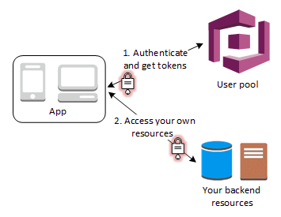
</p>

**Etapa 1** - o usuário do aplicativo faz login por meio de um grupo de usuários e recebe tokens desse grupo após uma autenticação bem-sucedida;<br />
**Etapa 2** - Em seguida, a aplicação troca os tokens do grupo de usuários por credenciais da AWS por meio de um grupo de identidades;<br />
**Etapa 3** - Por fim, o usuário da aplicação pode usar essas credenciais para acessar rotas privadas da API.

👉 [Mais informações sobre o Cognito](https://docs.aws.amazon.com/pt_br/cognito/latest/developerguide/what-is-amazon-cognito.html)

<hr />

### Estratégia de captura de erros com o Sentry

<p align="center">
    
</p>

O **Sentry** é um serviço open source para logar erros da aplicação.

A aplicação é configurada para que sempre que ocorrer um erro do tipo 500, a exceção seja capturada e catalogada no Sentry, indicando exatamente a linha que ocorreu o erro, assim como dados de data e hora, tornando mais fácil a identificação de bugs, como mostra no exemplo abaixo:

<p align="center">
    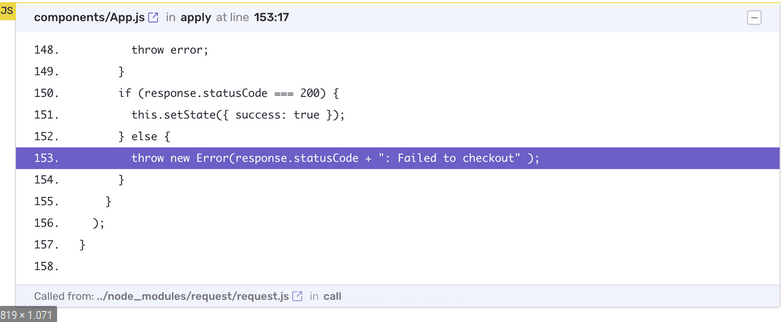
</p>

👉 [Mais informações sobre o Sentry](https://blog.locaweb.com.br/temas/codigo-aberto/voce-consegue-prever-os-bugs-de-sua-aplicacao/)<br />
👉 [Link oficial do serviço](https://sentry.io)

<hr />

### Arquitetura do backend: Feature by Package

Feature by Package é uma arquitetura que utiliza conceitos do **DDD (Domain Driven Design)**, com o objetivo de tornar o código mais **flexível**, **escalável** e de **manutenção simples**.

#### Vantagens da arquitetura

-   **Manutenção**: Facilita o engajamento de multiplas equipe e colaboradores em um projeto;
-   **Escalável**: Facilita refatoramento do código monolítico para uma uma estrura de microserviços;
-   **SOLID**: Facilita a aplicação de todos os princípios do SOLID;
-   **Git**: Melhora o gerenciamento dos commits, evitando conflitos e etc;
-   **Testes**: Facilita o desenvolvimento de testes de unidade e integração.

## Diagrama de relacionamentos

<p align="center">
    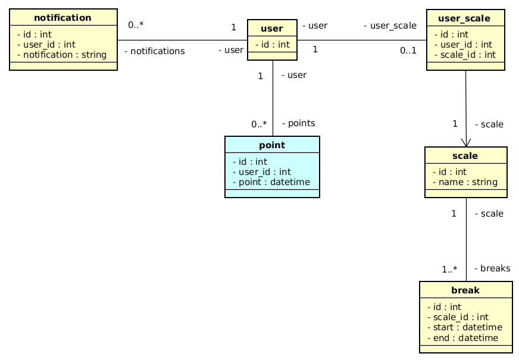
</p>

| Descrição                   | Data de modificação | Versão | Link de download                            |
| --------------------------- | ------------------- | ------ | ------------------------------------------- |
| Segunda versão do documento | 01 de abril de 2022 | v2     | [Download](./media/diagrams/diagram-v2.png) |

👉 [Download do arquivo do Astah](./media/diagrams/diagram-relational-v1.asta)

<details>
<summary>DIAGRAMA DETALHADO</summary>

<p align="center">
    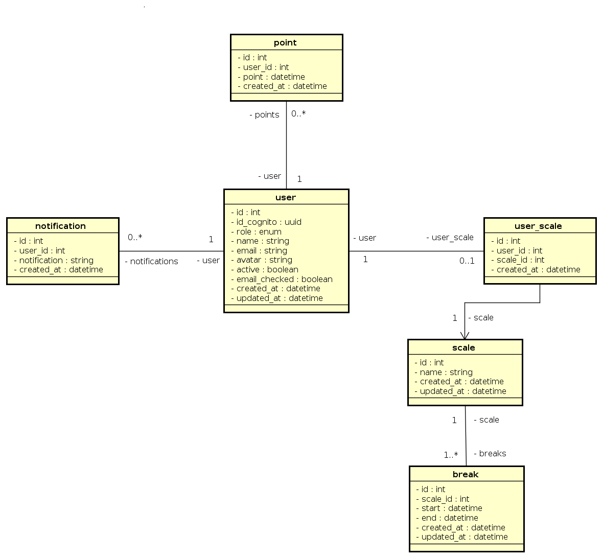
</p>

| Descrição                    | Data de modificação | Versão | Link de download                                 |
| ---------------------------- | ------------------- | ------ | ------------------------------------------------ |
| Primeira versão do documento | 04 de abril de 2022 | v1     | [Download](./media/diagrams/diagram-full-v1.png) |

👉 [Download do arquivo do Astah](./media/diagrams/diagram-full-v1.asta)

</details>

<details>
<summary>JSON</summary>

```json
{
    "USERS": [
        {
            "id": 1,
            "name": "Vanessa"
        },
        {
            "id": 2,
            "name": "Tiago"
        }
    ],
    "POINTS": [
        {
            "id": 1,
            "user_id": 1,
            "point": "21-03-2022 13:34"
        },
        {
            "id": 2,
            "user_id": 2,
            "point": "21-03-2022 13:37"
        }
    ],
    "SCALES": [
        {
            "id": 100,
            "name": "Horário completo"
        },
        {
            "id": 200,
            "name": "Horário meio dia manhã"
        },
        {
            "id": 300,
            "name": "Horário meio dia Tarde"
        }
    ],
    "BREAKS": [
        {
            "id": 1,
            "scale_id": 100,
            "time_start": "08:00",
            "time_end": "12:00"
        },
        {
            "id": 2,
            "scale_id": 100,
            "time_start": "13:00",
            "time_end": "17:00"
        },
        {
            "id": 3,
            "scale_id": 200,
            "time_start": "08:00",
            "time_end": "12:00"
        },
        {
            "id": 4,
            "scale_id": 300,
            "time_start": "13:00",
            "time_end": "17:00"
        }
    ],
    "NOTIFICATIONS": [
        {
            "id": 1,
            "user_id": 1,
            "notification": "Vanessa efetuou uma marcação de ponto!",
            "created_at": "21-03-2022 13:34"
        },
        {
            "id": 1,
            "user_id": 2,
            "notification": "Tiago efetuou uma marcação de ponto!",
            "created_at": "21-03-2022 13:37"
        }
    ]
}
```

</details>

## Endpoints (Proxy - API Gateway)

| Path                                                                                        | Método | Token | Role  | Descrição                  |
| ------------------------------------------------------------------------------------------- | ------ | ----- | ----- | -------------------------- |
| **USER**                                                                                    |
| [/account](https://mypoint.venzel.com.br/account)                                           | GET    |       | ALL   | Efetua login               |
| [/account](https://mypoint.venzel.com.br/account)                                           | POST   |       | ALL   | Cria um usuário            |
| [/password-recover](https://mypoint.venzel.com.br/password-recover)                         | POST   |       | ALL   | Recupera a senha           |
| [/users](https://mypoint.venzel.com.br/users)                                               | GET    | 🔥    | ADMIN | Lista todos os usuários    |
| [/users/{id}](https://mypoint.venzel.com.br/users/1)                                        | GET    | 🔥    | ADMIN | Exibe um usuário           |
| [/users/{id}](https://mypoint.venzel.com.br/users/1)                                        | DELETE | 🔥    | USER  | Deleta um usuário          |
| [/users/{id}](https://mypoint.venzel.com.br/users/1)                                        | PUT    | 🔥    | USER  | Edita um usuário           |
| [/user-status-toggler/{id}](https://mypoint.venzel.com.br/user-status-toggler/1)            | PATCH  | 🔥    | ADMIN | Altera o status do usuário |
| [/find-user?name={name}...](https://mypoint.venzel.com.br/find-user?name=tiago&page=number) | GET    | 🔥    | ADMIN | Busca por usuário          |
| **SCALE**                                                                                   |
| [/scales](https://mypoint.venzel.com.br/scales)                                             | GET    | 🔥    | ADMIN | Lista as ecalas            |
| [/scales](https://mypoint.venzel.com.br/scales)                                             | POST   | 🔥    | ADMIN | Cria uma escala            |
| [/scales/{id}](https://mypoint.venzel.com.br/scales/1)                                      | PUT    | 🔥    | ADMIN | Altera uma escala          |
| [/scales/{id}](https://mypoint.venzel.com.br/scales/1)                                      | DELETE | 🔥    | ADMIN | Delete uma escala          |
| [/scales/{id}](https://mypoint.venzel.com.br/scales/1)                                      | GET    | 🔥    | USER  | Exibe uma escala           |
| **USER/SCALE**                                                                              |
| [/manager-user-escale](https://mypoint.venzel.com.br/manager-user-escale)                   | GET    | 🔥    | ADMIN | Lista usuários e ecalas    |
| [/manager-user-escale/{1}](https://mypoint.venzel.com.br/manager-user-escale/1)             | UPDATE | 🔥    | ADMIN | Editar escalas do usuário  |
| [/manager-user-escale/{1}](https://mypoint.venzel.com.br/manager-user-escale/1)             | DELETE | 🔥    | ADMIN | Deleta escala do usuário   |
| **POINT**                                                                                   |
| [/points](https://mypoint.venzel.com.br/points)                                             | POST   | 🔥    | USER  | Cria um ponto              |
| **REPORT**                                                                                  |
| [/reports](https://mypoint.venzel.com.br/reports)                                           | GET    | 🔥    | USER  | Exibe o relatório          |

### Download do projeto do Insomnia

[](https://insomnia.rest/run/?label=MyPoint&uri=https%3A%2F%2Fraw.githubusercontent.com%2Fvenzel%2Fmypoint%2Fmaster%2F./media/insomnia/insomnia_2022-04-03.json)

### Swagger

<p align="center">
    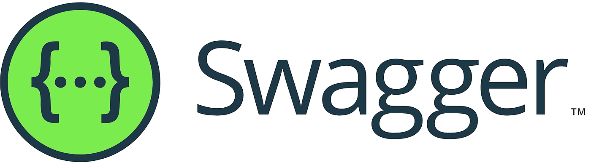
</p>

O **Swagger** é um framework composto por diversas ferramentas que, independente da linguagem, auxilia a descrição, consumo e visualização de serviços de uma API REST.

👉 [Link do Swagger de QA](http://mypoint-qa.venzel.com.br/api)<br />
👉 [Link do Swagger de Produção](http://mypoint.venzel.com.br/api)

## Diagrama de caso de uso

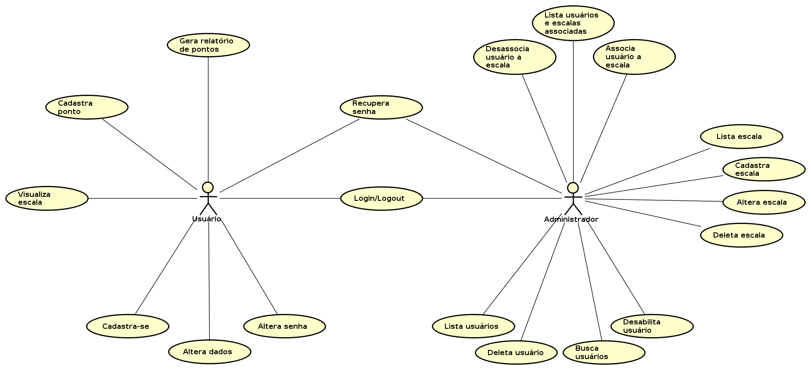

| Descrição                    | Data de modificação | Versão | Link de download                                     |
| ---------------------------- | ------------------- | ------ | ---------------------------------------------------- |
| Primeira versão do documento | 03 de abril de 2022 | v1     | [Download](./media/diagrams/diagram-use-case-v1.png) |

👉 [Download do arquivo do Astah](./media/diagrams/diagram-use-case-v1.asta)

## Requisitos funcionais

### Usuário

1. O **USUÁRIO/ADMIN** deve poder efetuar o **login/logout**;
2. O **USUÁRIO** deve poder se **cadastrar**;
3. O **USUÁRIO** deve poder **alterar seus dados** (nome);
4. O **USUÁRIO** deve poder **alterar sua senha**;
5. O **USUÁRIO/ADMIN** deve poder **recuperar sua senha**;
6. O **ADMIN** deve poder **visualizar os usuários** do sistema;
7. O **ADMIN** deve poder **deletar um usuário** do sistema;
8. O **ADMIN** deve poder **desabilitar/habilitar um usuário** do sistema;
9. O **ADMIN** deve poder **buscar por usuários** de forma paginada.

### Escala

1. O **ADMIN** deve poder **listar as escalas**;
2. O **ADMIN** deve poder **cadastrar uma escala**;
3. O **ADMIN** deve poder **alterar uma escala**;
4. O **ADMIN** deve poder **deletar uma escala**;
5. O **USUÁRIO** deve poder **visulizar uma escala**.

### Usuário/Escala

1. O **ADMIN** deve poder **visualizar uma listagem com usuários e escalas associadas**;
2. O **ADMIN** deve poder **associar uma usuário a uma escala**;
3. O **ADMIN** deve poder **desassociar um ou vários usuários a uma escala**.

### Usuário/Ponto

1. O **USUÁRIO** deve poder **cadastrar um ponto**.

### Usuário/Relatório

1. O **USUÁRIO** deve poder **gerar um relatório de pontos**.

## CI/CD

### Gitflow

O Gitflow é um fluxo de trabalho que auxilia o desenvolvimento contínuo de software entre a equipe envolvida.

👉 <a href="https://www.atlassian.com/br/git/tutorials/comparing-workflows/gitflow-workflow">Mais informações</a>

## Branchs

<p align="center">
    
</p>

-   **user** - Envia commits apenas para o próprio user, exemplo: tiago-feature-21.
-   **develop** - Recebe merges dos users. (**Ambiente de QA**)
-   **master** 🔒 - Recebe merges da develop, no final de uma release. (**Ambiente de produção**)

### Diretrizes

\* A branch **master** 🔒 é bloqueada para receber commits de usuários.<br /> \* A branch **master** representa o software em **produção**.<br /> \* A branch **develop** representa o software em **QA**.<br /> \* Fica determinado que sempre que um pull request na branch develop for aprovado ou reprovado, a branch do usuário **NÃO** será deletada, a fim de manter o git organizado.

👉 [Documentação completa do gitflow - passo a passo](./gitflow.md)

## Padronização de commits (Conventional Commits)

<p align="center">
    
</p>

**Conventional Commits** é uma convenção de mensagens de commits. Essa convenção descrevendo os recursos, correções e alterações importantes feitas nas mensagens.

### Flags utilizadas:

| Ícone | Flag         | Descrição                                                                                               |
| ----- | ------------ | ------------------------------------------------------------------------------------------------------- |
| 🪲    | **fix**      | Correção de bug para o usuário                                                                          |
| ☂️    | **feat**     | Desenvolvimento de uma nova funcionalidade                                                              |
| 📃    | **docs**     | Alterações na documentação                                                                              |
| ✂️    | **refactor** | Refatoração de um bloco de código                                                                       |
| 💅    | **style**    | Formatação, falta de ponto e vírgula, etc                                                               |
| 🔧    | **perf**     | Uma mudança de código que melhora o desempenho                                                          |
| 🔨    | **build**    | Alterações que afetam o sistema de compilação ou dependências externas (escopos de exemplo: gulp e npm) |
| 🪀    | **ci**       | Alterações em arquivos e scripts de configuração de CI (escopos de exemplo: Travis, Circle e Codeship)  |
| 🧪    | **test**     | Adicionando testes ausentes ou corrigindo testes existentes                                             |

### Exemplos de commits utilizando a padronização

```bash
# Exemplo 1
git commit -m "🪲 fix: corrige bug da listagem de usuários."
```

```bash
# Exemplo 2
git commit -m "☂️ feat: cria o módulo de pontos."
```

👉 [Mais informações](https://www.conventionalcommits.org/en/v1.0.0/)

## Lint com o Sonarlint

<p align="center">
    
</p>

O **Sonarlint** é um plugin detector, em tempo real, de códigos mal escritos, que geram dificuldades de manutenção, bugs e vulnerabilidades. O SonarLint possui também as seguintes categoriazações de códigos: Minor, Major, Critical e Blocker.

👉 [Mais informações](https://ilegra.com/blog/do-zero-sonarlint-para-que-serve-esse-plugin-e-por-que-voce-nao-vai-mais-viver-sem-ele/)

## Prettier

<p align="center">
    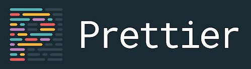
</p>

O **Prettier** é um formatador de código que visa ajudar os desenvolvedores a escrever aplicações que são mais fáceis de entender e mais uniformizadas entre as diversas formas de programar que existem.

Arquivo **.prettierrc** na raiz do projeto.

```json
{
    "semi": true,
    "tabWidth": 4,
    "printWidth": 90,
    "singleQuote": true,
    "trailingComma": "es5"
}
```

👉 [Link oficial](https://prettier.io)

## Pipeline

O **Codeship** é um serviço de entrega contínua hospedado que se concentra na velocidade, confiabilidade e simplicidade. Em nossa arquitetura, o Codeship é integrado com o Github, ele identifica automaticamente quando um commit é realizado e dá sequência na entrega para os ambientes pré configurados, como demonstra na imagem abaixo:

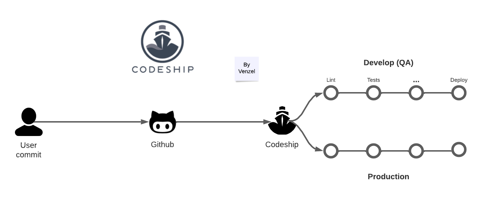

👉 [Link do arquivo no Lucidchart](https://lucid.app/documents/view/e3f44502-6734-49bd-bb02-aa1b2c4c54da)

### Etapas

1 - **Lint**: Nessa etapa é verificada as regras do Sonarlint;<br />
2 - **Test**: Nessa etapa é realizado os testes unitários;<br />
3 - **Build**: Nessa etapa é realizado o build da aplicação.

<hr />

© Documento de autoria de <a href="https://github.com/venzel/">Enéas Almeida</a>.
