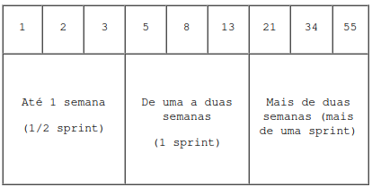
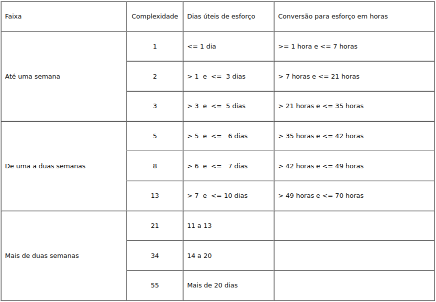

# FIBONACCI

[README](../../README.md)

## Guia para Estimativa de Esforço para Estórias/Tarefas

## Introdução

### Porque precisamos estimar o esforço das tarefas?

1. para poder dizer em quanto tempo somos capazes de fazer um determinado conteúdo (ou o quanto somos capazes de fazer em um período fixo de tempo);

2. para identificar perdas e ganhos de desempenho baseado na nossa velocidade; e

3. para fornecer ao PO a informação de custo de implementação para ele decidir a prioridade de execução das estórias.

## O que é e porque usar Fibonacci?

A série de Fibonacci é uma sequência numérica definida como {0, 1, 1, 2, 3, 5, 8, 13, 21, 34, 55 etc.} onde, a partir dos dois primeiro elementos, a série continua somando-se os dois elementos anteriores. Para uso nas estimativas de esforço, vamos usar a sequência a partir do terceiro elemento, já que não nos interessam estimativas com valor 0 e com a repetição do número 1. Assim, a sequência usada será {1,2,3,5,8,13,21,34,55}.

## Por que usar a série de Fibonacci e não outra, como a binária?

É interessante que os pontos fiquem cada vez mais espaçados à medida que vão crescendo. Com isso, a imprecisão fica embutida na própria escala da medida. Sempre quando estimamos coisas grandes o erro também aumenta, então faz sentido espaçamentos maiores. Também se evita discussões do tipo: "essa tarefa é 38 ou 39 pontos?", é 40 e pronto.

A série de Fibonacci cresce mais rapidamente que a série binária, sempre pode-se quebrar a estória em duas de tamanho imediatamente menor. Isso é a própria regra de Fibonacci: FIB(i) = FIB(i-1) + FIB(i-2). Essa proporção entre as estórias quebradas segue a razão áurea, que é uma razão recorrente na natureza.

## Como usar o esquema de estimativa de esforço

A série de Fibonacci também é usada para estimar o esforço das tarefas dos projetos. Abaixo está um quadro do esquema utilizado:

    

Ao avaliar o esforço necessário para a realização de uma tarefa, deve-se escolher uma das faixas de esforço:

1. **Até uma semana**: significa que a demanda/tarefa pode ser realizada em até 5 dias úteis, ou seja, na metade de uma sprint (considerando sprints de 2 semanas);

2. **De uma a duas semanas**: significa que a demanda/tarefa necessita de mais de 5 dias úteis para ser realizada, mas menos de 10 dias úteis. A demanda será concluída ainda dentro do período de uma sprint.

3. **Mais de duas semanas**: a demanda necessitará de mais de 10 das úteis para ser realizada, isto é, mais do que o período de uma sprint.

Dentro de cada faixa ainda há uma escala que deve ser utilizada para chegar a um número que represente a complexidade estimada.

    

Assim, uma demanda que necessite de 4 dias úteis para ser realizada, deve ter a complexidade marcada com o número 3. Já outra demanda que necessite de 9 dias úteis para ser realizada, deve ter a complexidade marcada como 13.

Em todos os casos, o esforço estimado se refere a um programador, trabalhando em tempo integral na demanda, durante o período de 7 horas diárias.

© Documento de autoria de <a href="http://www.trt4.jus.br/portaltrt/processoDS/PLUG_Processo_SDS/guidances/guidelines/GDL_EstimativaEsforco_B87A7DB9.html">TRF4</a>.
